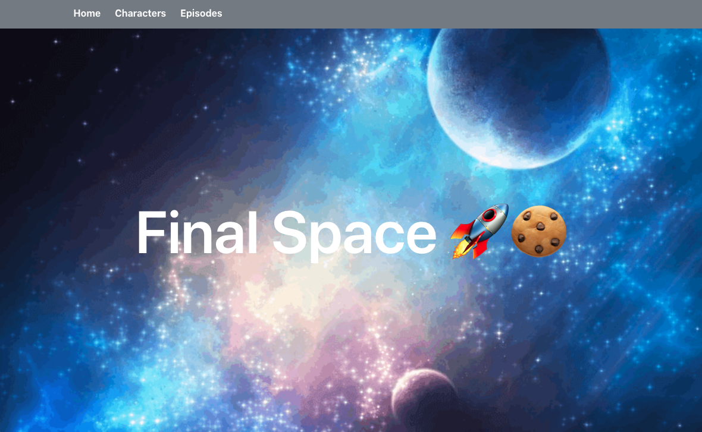

# Final Space

### Overview
My second project on the Software Engineering Immersive course, as a pair, built a react app in a 48-hour hackathon.
My app was based on the Netflix show Final Space which depicts a futuristic fantasy
Joe Freeman - [GitHub]()


### Deployment
The app has been deployed with netlify and can be found here: [Deployed App](https://aromifinalspace.netlify.app)

### Getting Started
1. Access the source code via the 'Clone or download' button
2. In CLI, run `npm i` on the root level to install dependencies
3. Run `npm run dev`  to run program in your local environment

### Brief:
The goal was to build a React front-end application using a publicly available API within 48 hours. Build a React application that consumes any public API.

### Technologies Used:
* React.js
* JavaScript (ES6)
* HTML5
* CSS
* [FinalSpaceAPI](https://finalspaceapi.com/)
* Axios
* Insomnia REST Client
* Node
* react-router-dom
* react-notify-toast
* Bulma CSS Framework

### Process
#### Planning
To begin this process, my teammate and I browsed through the free APIs that were available on the internet and we settled on the final space API. We analysed the end-points available in the API and used that to determine our MVP and stretch goals. We planned out the different components of the app and determined what we wanted on each page based on what was available in the API.

#### Build
We created a character index page that showed all the characters on the show, their name and their place of birth. This page also included a search and filter function to enable users to quickly browse to their favourite character.

``` JavaScript
  React.useEffect(() => {
    const getData = async () => {
      try {
        const response = await getAllCharacters()   
        setCharacters(response.data)      
      } catch (err) {
        setIsError(true)
      }
      
    }
    getData()
  }, [])
  
  
  const handleSearch = (e) => {
    setSearchValue(e.target.value)
  }
  const filteredCharacters = (characters) => {
    return characters.filter(character => {
      return character.name.toLowerCase().includes(searchValue.toLowerCase())
    })
  }
  ```
  From the character index page, we made each character card clickable which takes you to the character show page.
  On the character show page, it included a function that returns a random quote made the character in a toasty pop-up.

  ``` JavaScript
   React.useEffect(() => {
    const getData = async () => {
      try {
        const characterResponse = await getSingleCharacter(characterId)
        setCharacter(characterResponse.data)
        const quoteResponse = await getAllQuotes()
        const quotesArray = quoteResponse.data.filter(quote => {
          if (quote.by === characterResponse.data.name) {
            return quote
          }

        })
        createNotification(quotesArray[Math.floor(Math.random() * quotesArray.length)].quote)
      } catch (err) {
        setIsError(true)
      }
    }
    getData()
  }, [characterId])
  ```
  We also randomised the character alias and the ability that shows each time the page is re-rendered.

  ``` JavaScript
  <h4 className="title is-4">
                  <span role="img" aria-label="lightning">
                    ⚡️
                  </span> {' '}
                  Abilities
                </h4>
                <p>{character.abilities[Math.floor(Math.random() * character.abilities.length)]}</p>
                <hr />
                <h4 className="title is-4">
                  <span role="img" aria-label="globe">
                    @
                  </span> {' '}
                  Alias
                </h4>
                <p>{character.alias[Math.floor(Math.random() * character.alias.length)]}</p>
```
We also included an episode index page that can be filtered based on the season 

``` JavaScript
 const handleSelect = (e) => {
    setSelectedSeason(e.target.value)
  }

  const filteredEpisodes = (episodes) => {
    return episodes.filter(episode => {
      return episode.air_date.includes(selectedSeason) || selectedSeason === 'all'
    })
  }
  ```
  ``` JavaScript
   <select onChange={handleSelect}>
      <option value="all">All Seasons</option>
      <option value="2018">Season One</option>
      <option value="2019">Season Two</option>
   </select>
  ```

One of our stretch goals was to link the episode cards to the episode on Netflix. This endpoint was not available in the FTA so we manually added the episodes, linked it to the EpisodeId and used that to set up an href link.

``` JavaScript 


export const episodes = {
  '1': 'https://www.netflix.com/watch/80174386?trackId=13752289&tctx=0%2C1%2Cf7095036fa255a1577391c16edbc6249ecf0a6ec%3Ad66d80365c0697a1c9e1fca7ed06340d33145c35%2Cf7095036fa255a1577391c16edbc6249ecf0a6ec%3Ad66d80365c0697a1c9e1fca7ed06340d33145c35%2Cunknown%2C%2C',
  '2': 'https://www.netflix.com/watch/81001394?trackId=13752289',
  '3': 'https://www.netflix.com/watch/81001395?trackId=200257858',
  '4': 'https://www.netflix.com/watch/81001396?trackId=200257858',
  '5': 'https://www.netflix.com/watch/81001397?trackId=200257858',
  '6': 'https://www.netflix.com/watch/81001398?trackId=200257858',
  '7': 'https://www.netflix.com/watch/81001399?trackId=200257858',
  '8': 'https://www.netflix.com/watch/81001400?trackId=200257858',
  '9': 'https://www.netflix.com/watch/81001401?trackId=200257858',
  '10': 'https://www.netflix.com/watch/81001402?trackId=200257858',
  '11': 'https://www.netflix.com/watch/81106565?trackId=200257858',
  '12': 'https://www.netflix.com/watch/81106566?trackId=200257858',
  '13': 'https://www.netflix.com/watch/81106567?trackId=200257858',
  '14': 'https://www.netflix.com/watch/81106568?trackId=200257858',
  '15': 'https://www.netflix.com/watch/81106569?trackId=200257858',
  '16': 'https://www.netflix.com/watch/81106570?trackId=200257858',
  '17': 'https://www.netflix.com/watch/81106571?trackId=200257858',
  '18': 'https://www.netflix.com/watch/81106572?trackId=200257858',
  '19': 'https://www.netflix.com/watch/81106573?trackId=200257858',
  '20': 'https://www.netflix.com/watch/81106574?trackId=200257858',

}
```
``` JavaScript 
      <div className="card-image">
        <figure className="image image-is-1by1">
          <a href={episodes[episodeId]} target="_blank" rel="noreferrer">  </a>
        </figure>
      </div>
```

### Known Errors or Bugs
A few minutes before hand-in we noticed that when characters did not have quotes, the toasty pop up would display an error message and due to us not having enough time to write the logic to mitigate against this, we had to remove the error handling for that page for better user experience.

### Challenges
* One of the challenges we faced was filtering episodes as it was presented as dates in the API not season. Wrote logic to link the two by targeting the date value as we knew which year each season was released.
* Linking the episodes was also a challenge as the API did not include the episodes link. We figured out how to link the episodes manually but this was a slug and if the show had more seasons/episodes it may have been impossible to implement in the time frame we had.

### Wins
A big win was generating the random quotes via a toasty as it meant linking two models - Quotes and Characters into one then mapping through the quotes endpoint to display the quote on the character show pages.

### Future Improvements
* One of our stretch goals was to create a game with quotes where users could guess which character said a particular quote. 

### Key Learnings
* Learning to work as a pair and utilise pair-coding on a small project was invaluable. 
* Identifying the different functions you could enact based on an API you did not create was also an invaluable lesson.


